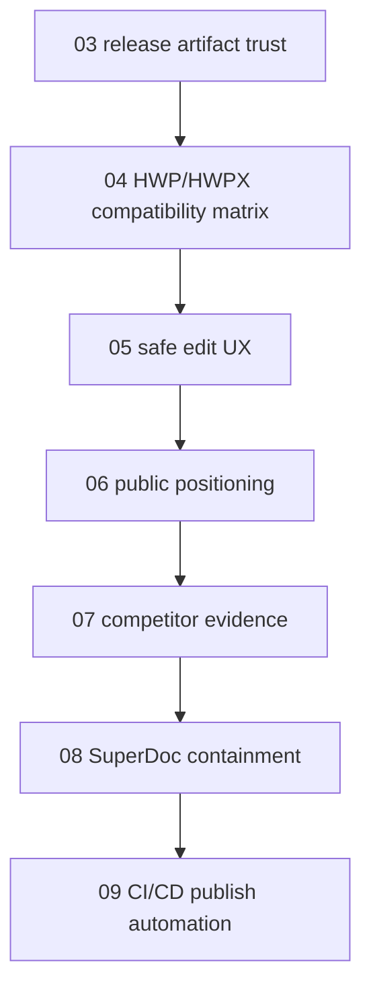

# 02 Follow-Up Patch Index

## Purpose

This index turns the corrected competitive review into a lexicographic patch
sequence. The goal is not to add random features. The goal is to make
`code-office` credible for broader public distribution by proving the parts
that matter:

1. local HWP/HWPX editing is the strongest wedge;
2. WYSIWYG document editing inside VS Code has a real gap;
3. release artifacts must become verifiable, not only published;
4. compatibility evidence must be public;
5. cross-format workspace value must be explained without claiming to replace
   Obsidian or full office suites.

## Lexicographic Patch Set

| File | Track | Outcome |
|---|---|---|
| `03_release_artifact_trust_patch.md` | GitHub Releases and provenance | Every public release has VSIX artifacts, checksums, release notes, and source tag evidence. |
| `04_hwp_hwpx_compatibility_matrix_patch.md` | HWP/HWPX proof | Public fixture matrix proves open/edit/save/reopen/export behavior. |
| `05_safe_edit_ux_patch.md` | Editor safety | HWP/HWPX and DOCX editing surfaces communicate risk, backup, recovery, and failed-save behavior. |
| `06_public_positioning_patch.md` | Product message | README, Marketplace, Open VSX, and Pages lead with local HWP/HWPX + cross-format review. |
| `07_competitor_evidence_patch.md` | Competitive honesty | Public comparison separates viewer/editor/save lifecycle claims from install count. |
| `08_superdoc_containment_patch.md` | DOCX risk control | SuperDoc is kept useful but bounded by license, version, fallback, and regression gates. |
| `09_ci_cd_release_publish_patch.md` | Automation | Tag-triggered CI/CD builds release artifacts and can publish registries after guarded verification. |

## Execution Order

## Shared Acceptance Rules

- No personal/private document fixtures are committed.
- Every release-trust claim has an artifact path, command output, or public URL.
- HWP/HWPX claims must distinguish HWP native write, HWPX package write, and
  conversion/fallback behavior.
- Marketplace/Open VSX copy must not imply unsupported fidelity.
- CI/CD publish automation must be separable from artifact generation so tokens
  can be introduced safely.

## Non-Goals

- Do not build an Obsidian replacement.
- Do not add unrelated viewer features before release-trust work.
- Do not weaken save validation to improve demos.
- Do not publish registry packages from an unverified local artifact.
