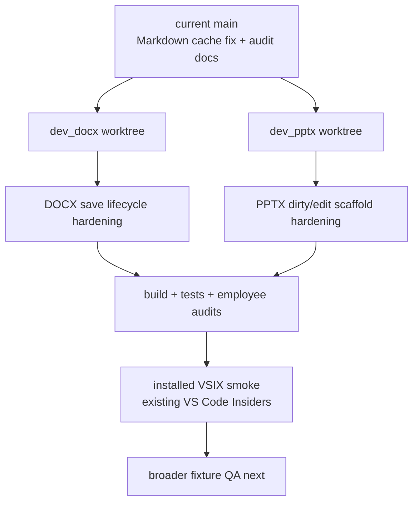

# DOCX/PPTX Merge-Readiness Plan

Date: 2026-06-07
Goal ID: `22bbe31b-9fa`

## Objective

Bring `dev_docx` and `dev_pptx` forward to current `main`, resolve the audit
issues that prevent employee agreement, and carry the integrated `dev_pptx`
branch through installed-VSIX smoke in the already-open VS Code Insiders window.
This work does not merge either branch into `main`; it stops before broader
fixture QA and final human merge approval.

## Current Repository Signals

Project root:

```text
/Users/jun/Developer/new/700_projects/code-office
```

Worktrees:

```text
/Users/jun/Developer/new/700_projects/code-office            main
/Users/jun/Developer/new/700_projects/code-office--dev_docx  dev_docx
/Users/jun/Developer/new/700_projects/code-office--dev_pptx  dev_pptx
```

Branch base:

```text
dev_docx merge-base main = 48f7ab5
dev_pptx merge-base main = 48f7ab5
```

Implication: both branches predate the Markdown wikilink cache fix and the
latest audit devlogs. They must be updated from `main` before final QA.

## Easy Explanation

There are two side branches. First, copy the latest `main` work into each branch
so they do not lose the Markdown speed fix. Then repair the things employees
complained about: DOCX save behavior, PPTX dirty/edit signals, and installed
VSIX save routing. Finally, run builds/tests, employee audits, and a small
existing-window VS Code smoke so the branches are ready for broader QA and final
merge approval.

## Change Map



## Prior Audit Closure Matrix

| Prior finding | Required closure | Evidence required before GUI QA |
|---|---|---|
| DOCX `Cmd+S` only marks dirty | Add explicit `docxHostSaveRequest` from WebView to host; host runs `workbench.action.files.save`; provider remains owner of byte export | Source assertion/test proves event exists in WebView and handler; build passes |
| DOCX `__autosave` response has no host consumer | Remove or neutralize `__autosave`; WebView should answer only host `docxSaveRequest` for disk writes | Focused test/source assertion proves no `requestId: "__autosave"` emission remains |
| PPTX edit mode lacks positive dirty path | Add explicit edit-mode user action that marks dirty and emits `pptxDirtyChanged { isDirty: true }` | `pptxPhase4Test` or equivalent source assertion proves dirty true path |
| PPTX dirty signal may not mean semantic PPTX mutation | Either call a real `pptx-svg` mutation API if available, or document this as pre-GUI scaffold and keep semantic persistence for manual GUI QA | Verification doc states exact boundary and residual risk |
| Branches predate Markdown cache fix | Merge current `main` into each branch and verify branch contains main wikilink cache files/tests | Git evidence: branch merge commit, `npm run test:markdown` PASS |
| Existing DOCX/PPTX docs stale | Add phase docs with implementation, verification, residual risk, and GUI QA checklist | `01_phase_01_dev_docx_update.md`, `02_phase_02_dev_pptx_update.md`, `03_verification.md` |

## Planned Branch Operations

### `dev_docx`

Worktree:

```text
/Users/jun/Developer/new/700_projects/code-office--dev_docx
```

Planned git operation:

```text
git merge main
```

Merge prediction:

- Backend plan audit reports `git merge-tree --write-tree` predicts clean merges
  for both branches.
- `main` changed Markdown/cache/devlog files after `48f7ab5`, not DOCX/PPTX
  routing files.

Conservative conflict class if local state changes before implementation:

- `package.json`
- `src/extension.ts`
- `src/provider/officeViewerProvider.ts`
- possible devlog files from branch divergence

Resolution policy:

- Preserve current `main` Markdown cache files and devlog/audit files.
- Preserve `dev_docx` DOCX provider/editor changes.
- Ensure `.docx/.dotx` are routed to `cweijan.docxEditor`, not legacy
  `cweijan.officeViewer`.

### `dev_pptx`

Worktree:

```text
/Users/jun/Developer/new/700_projects/code-office--dev_pptx
```

Planned git operation:

```text
git merge main
```

Merge prediction:

- Backend plan audit reports `git merge-tree --write-tree` predicts clean merges
  for both branches.
- `main` changed Markdown/cache/devlog files after `48f7ab5`, not DOCX/PPTX
  routing files.

Conservative conflict class if local state changes before implementation:

- `package.json`
- `src/extension.ts`
- `src/provider/officeViewerProvider.ts`
- possible devlog files from branch divergence

Resolution policy:

- Preserve current `main` Markdown cache files and devlog/audit files.
- Preserve `dev_pptx` PPTX provider/view/edit changes.
- Ensure `.pptx/.pptm/.ppsx` are routed to `cweijan.pptxEditor`, not legacy
  `cweijan.officeViewer`.

## Planned Code Changes

### DOCX branch

Modify:

```text
/Users/jun/Developer/new/700_projects/code-office--dev_docx/src/react/view/word/Word.tsx
/Users/jun/Developer/new/700_projects/code-office--dev_docx/src/provider/handlers/docxHandler.ts
/Users/jun/Developer/new/700_projects/code-office--dev_docx/src/test/docxEditorProviderTest.mjs
/Users/jun/Developer/new/700_projects/code-office--dev_docx/src/test/wikilinkResolverTest.mjs
```

Intent:

- Replace ambiguous `__autosave` response behavior with an explicit host-save
  request path.
- Keep host-owned save lifecycle authoritative: WebView exports bytes only when
  the provider sends `docxSaveRequest`.
- Add focused source-level regression coverage:
  - `Word.tsx` emits `docxHostSaveRequest`.
  - `Word.tsx` no longer emits `requestId: "__autosave"`.
  - `docxHandler.ts` handles `docxHostSaveRequest` by running
    `workbench.action.files.save`.
- Add or update regression coverage so the branch proves the Markdown cache fix
  remains after merging `main`.

Expected before/after:

```text
Before:
WebView Cmd+S -> docxDirtyChanged only
Editor onSave -> docxSaveResponse { requestId: "__autosave" }

After:
WebView Cmd+S -> docxDirtyChanged + docxHostSaveRequest
Host receives docxHostSaveRequest -> workbench.action.files.save
Provider saveCustomDocument -> docxSaveRequest -> WebView save -> docxSaveResponse
```

### PPTX branch

Modify:

```text
/Users/jun/Developer/new/700_projects/code-office--dev_pptx/src/react/view/pptx/Pptx.tsx
/Users/jun/Developer/new/700_projects/code-office--dev_pptx/src/provider/handlers/pptxHandler.ts
/Users/jun/Developer/new/700_projects/code-office--dev_pptx/src/react/view/pptx/Pptx.less
/Users/jun/Developer/new/700_projects/code-office--dev_pptx/src/test/pptxPhase4Test.mjs
/Users/jun/Developer/new/700_projects/code-office--dev_pptx/src/test/wikilinkResolverTest.mjs
```

Intent:

- Remove dead `__autosave` host listener.
- Add a minimal explicit edit signal in edit mode so the provider lifecycle can
  be tested before GUI QA.
- Emit `pptxDirtyChanged { isDirty: true }` when the user makes the explicit
  edit-mode change.
- If no stable `pptx-svg` mutation API is available, document that this is a
  pre-GUI dirty/save scaffold and that semantic PPTX content mutation remains a
  manual GUI QA gate.
- Keep `exportPptx()` as the provider-owned save response path.
- Preserve high-fidelity view mode and WASM export plumbing.

Expected before/after:

```text
Before:
Edit mode renders SVG
No positive dirty=true path
saveCustomDocument normally returns because document.isDirty is false

After:
Edit mode renders SVG
User-visible edit-mode mark/change path emits dirty=true
saveCustomDocument can request export through the existing bridge
```

## Documentation Changes

Create/update in main:

```text
/Users/jun/Developer/new/700_projects/code-office/devlog/_plan/260607_docx_pptx_merge_readiness/00_overview.md
/Users/jun/Developer/new/700_projects/code-office/devlog/_plan/260607_docx_pptx_merge_readiness/01_phase_01_dev_docx_update.md
/Users/jun/Developer/new/700_projects/code-office/devlog/_plan/260607_docx_pptx_merge_readiness/02_phase_02_dev_pptx_update.md
/Users/jun/Developer/new/700_projects/code-office/devlog/_plan/260607_docx_pptx_merge_readiness/03_verification.md
/Users/jun/Developer/new/700_projects/code-office/devlog/_plan/260607_docx_pptx_merge_readiness/90_research_cross_branch_audit.md
```

Optional structure update:

```text
/Users/jun/Developer/new/700_projects/code-office/structure/04-viewer-architecture.md
```

Only update structure if the branch readiness changes architectural truth that
should be visible outside the devlog.

## Verification Plan

Per branch:

```text
npm run build
npm run test:markdown
npm run test:ci
```

Additional branch-specific checks:

```text
dev_docx: npm run test:docx-editor-provider if added; otherwise node focused source assertion
dev_pptx: npm run test:pptx-phase4 with dirty/save assertions
```

`03_verification.md` must contain:

- branch name and HEAD SHA
- merge commit SHA or fast-forward evidence from `git merge main`
- list of files changed after merge
- exact command output summaries with PASS/FAIL:
  - `npm run build`
  - `npm run test:markdown`
  - `npm run test:ci`
  - branch-specific focused test
- residual risks that are intentionally left to manual GUI QA
- explicit boolean: `Ready for broader fixture QA: yes/no`

Employee verification:

- Backend: provider lifecycle, merge safety, file IO, branch conflict resolution.
- Frontend: WebView edit/save UX readiness before manual GUI QA.
- Docs: devlog completeness, residual risks, QA checklist clarity.

All three employee re-audits must return PASS or PASS-with-nonblocking-notes.
Any FAIL blocks the goal from reaching "QA 직전" state.

## GUI QA Status And Next Checklist

Completed smoke in the already-open VS Code Insiders window:

```text
DOCX: open with DOCX Editor (code-office), edit marker, Cmd+S, marker present in word/document.xml
PPTX: open with PPTX Editor (code-office), View -> Edit, Apply QA note, Cmd+S, marker present in ppt/slides/*.xml
```

Documented in:

```text
/Users/jun/Developer/new/700_projects/code-office--dev_pptx/devlog/_plan/260607_docx_pptx_merge_readiness/04_gui_runtime_smoke.md
```

Broader QA still required before release/merge acceptance:

DOCX:

- Open a larger real-world fixture `.docx` in the installed extension or Extension Dev Host.
- Edit visible text.
- Press `Cmd+S` / `Ctrl+S`.
- Confirm disk bytes change.
- Close/reopen and confirm the visible edit persists.
- Confirm failed save keeps the editor dirty/open.

PPTX:

- Open a larger real-world fixture `.pptx` in the installed extension or Extension Dev Host.
- Confirm View mode renders slides.
- Switch to Edit mode.
- Trigger the explicit edit/dirty action.
- Press save.
- Reopen and verify that the edit action persisted semantically.
- Cover the case where VS Code remembers `Text Editor` as the default editor and
  confirm `Reopen Editor With...` exposes the code-office editor.

## Stop Condition

Stop before broader fixture QA and final merge approval. The final state should be:

- both branches updated with current `main`
- branches build and pass automated tests
- employee audits agree there is no known code/doc blocker before broader VS Code
  fixture QA
- installed-VSIX smoke in the already-open VS Code Insiders window is recorded
- devlog contains implementation and verification evidence
- no merge into `main` performed
