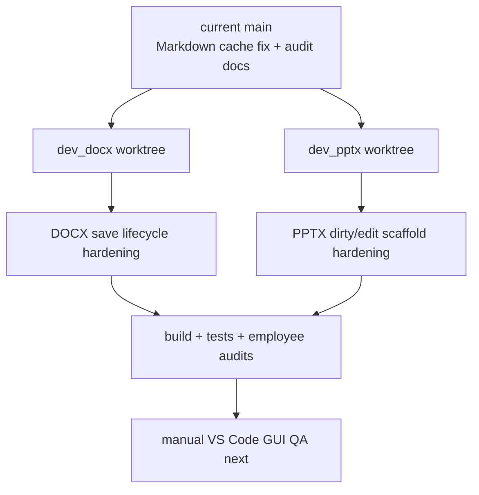

# DOCX/PPTX Merge-Readiness Plan

Date: 2026-06-07
Goal ID: `22bbe31b-9fa`

## Objective

Bring `dev_docx` and `dev_pptx` forward to current `main`, resolve the audit
issues that prevent employee agreement, and stop at the state immediately before
manual GUI QA. This work does not merge either branch into `main`.

## Current Repository Signals

Project root:

```text
/Users/jun/Developer/new/700_projects/code-office
```

Worktrees:

```text
/Users/jun/Developer/new/700_projects/code-office            main
/Users/jun/Developer/new/700_projects/code-office--dev_docx  dev_docx
/Users/jun/Developer/new/700_projects/code-office--dev_pptx  dev_pptx
```

Branch base:

```text
dev_docx merge-base main = 48f7ab5
dev_pptx merge-base main = 48f7ab5
```

Implication: both branches predate the Markdown wikilink cache fix and the
latest audit devlogs. They must be updated from `main` before final QA.

## Easy Explanation

There are two half-finished side branches. First, copy the latest `main` work
into each branch so they do not lose the Markdown speed fix. Then repair the
things employees complained about: DOCX save behavior and PPTX dirty/edit
signals. Finally, run builds/tests and employee audits so the branches are ready
for the next human step: actual VS Code GUI QA.

## Change Map



## Planned Branch Operations

### `dev_docx`

Worktree:

```text
/Users/jun/Developer/new/700_projects/code-office--dev_docx
```

Planned git operation:

```text
git merge main
```

Expected conflict class:

- `package.json`
- `src/extension.ts`
- `src/provider/officeViewerProvider.ts`
- possible devlog files from branch divergence

Resolution policy:

- Preserve current `main` Markdown cache files and devlog/audit files.
- Preserve `dev_docx` DOCX provider/editor changes.
- Ensure `.docx/.dotx` are routed to `cweijan.docxEditor`, not legacy
  `cweijan.officeViewer`.

### `dev_pptx`

Worktree:

```text
/Users/jun/Developer/new/700_projects/code-office--dev_pptx
```

Planned git operation:

```text
git merge main
```

Expected conflict class:

- `package.json`
- `src/extension.ts`
- `src/provider/officeViewerProvider.ts`
- possible devlog files from branch divergence

Resolution policy:

- Preserve current `main` Markdown cache files and devlog/audit files.
- Preserve `dev_pptx` PPTX provider/view/edit changes.
- Ensure `.pptx/.pptm/.ppsx` are routed to `cweijan.pptxEditor`, not legacy
  `cweijan.officeViewer`.

## Planned Code Changes

### DOCX branch

Modify:

```text
/Users/jun/Developer/new/700_projects/code-office--dev_docx/src/react/view/word/Word.tsx
/Users/jun/Developer/new/700_projects/code-office--dev_docx/src/provider/handlers/docxHandler.ts
/Users/jun/Developer/new/700_projects/code-office--dev_docx/src/test/wikilinkResolverTest.mjs
```

Intent:

- Replace ambiguous `__autosave` response behavior with an explicit host-save
  request path.
- Keep host-owned save lifecycle authoritative: WebView exports bytes only when
  the provider sends `docxSaveRequest`.
- Add or update regression coverage so the branch proves the Markdown cache fix
  remains after merging `main`.

Expected before/after:

```text
Before:
WebView Cmd+S -> docxDirtyChanged only
Editor onSave -> docxSaveResponse { requestId: "__autosave" }

After:
WebView Cmd+S -> docxDirtyChanged + docxHostSaveRequest
Host receives docxHostSaveRequest -> workbench.action.files.save
Provider saveCustomDocument -> docxSaveRequest -> WebView save -> docxSaveResponse
```

### PPTX branch

Modify:

```text
/Users/jun/Developer/new/700_projects/code-office--dev_pptx/src/react/view/pptx/Pptx.tsx
/Users/jun/Developer/new/700_projects/code-office--dev_pptx/src/provider/handlers/pptxHandler.ts
/Users/jun/Developer/new/700_projects/code-office--dev_pptx/src/react/view/pptx/Pptx.less
/Users/jun/Developer/new/700_projects/code-office--dev_pptx/src/test/pptxPhase4Test.mjs
/Users/jun/Developer/new/700_projects/code-office--dev_pptx/src/test/wikilinkResolverTest.mjs
```

Intent:

- Remove dead `__autosave` host listener.
- Add a minimal explicit edit signal in edit mode so the provider lifecycle can
  be tested before GUI QA.
- Emit `pptxDirtyChanged { isDirty: true }` when the user makes the explicit
  edit-mode change.
- Keep `exportPptx()` as the provider-owned save response path.
- Preserve high-fidelity view mode and WASM export plumbing.

Expected before/after:

```text
Before:
Edit mode renders SVG
No positive dirty=true path
saveCustomDocument normally returns because document.isDirty is false

After:
Edit mode renders SVG
User-visible edit-mode mark/change path emits dirty=true
saveCustomDocument can request export through the existing bridge
```

## Documentation Changes

Create/update in main:

```text
/Users/jun/Developer/new/700_projects/code-office/devlog/_plan/260607_docx_pptx_merge_readiness/00_plan.md
/Users/jun/Developer/new/700_projects/code-office/devlog/_plan/260607_docx_pptx_merge_readiness/10_dev_docx_update.md
/Users/jun/Developer/new/700_projects/code-office/devlog/_plan/260607_docx_pptx_merge_readiness/20_dev_pptx_update.md
/Users/jun/Developer/new/700_projects/code-office/devlog/_plan/260607_docx_pptx_merge_readiness/30_verification.md
```

Optional structure update:

```text
/Users/jun/Developer/new/700_projects/code-office/structure/04-viewer-architecture.md
```

Only update structure if the branch readiness changes architectural truth that
should be visible outside the devlog.

## Verification Plan

Per branch:

```text
npm run build
npm run test:markdown
npm run test:ci
```

Additional branch-specific checks:

```text
dev_docx: inspect DOCX provider save events and run focused wikilink regression
dev_pptx: run npm run test:pptx-phase4 and inspect dirty/save event paths
```

Employee verification:

- Backend: provider lifecycle, merge safety, file IO, branch conflict resolution.
- Frontend: WebView edit/save UX readiness before manual GUI QA.
- Docs: devlog completeness, residual risks, QA checklist clarity.

## Stop Condition

Stop before manual GUI QA. The final state should be:

- both branches updated with current `main`
- branches build and pass automated tests
- employee audits agree there is no known code/doc blocker before manual VS Code
  GUI QA
- devlog contains implementation and verification evidence
- no merge into `main` performed
