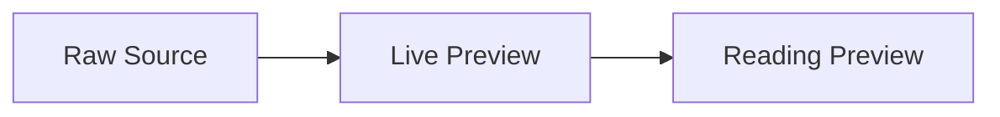

# Markdown Live Raw Regression

Live Preview should render inactive source spans while preserving the raw Markdown source.

```js
const target = "[[Daily Note]]";
console.log(target);
```

Inline code keeps markers: `[[NotALink]] ~~not strike~~ **not bold**`.



[[Daily Note]]
[[Missing Note|Pretty Missing]]

한국어 문장 안의 ~~이전 값~~ 과 **새 값** 을 함께 표시한다.
중첩 서식: **~~굵은 취소선~~**
