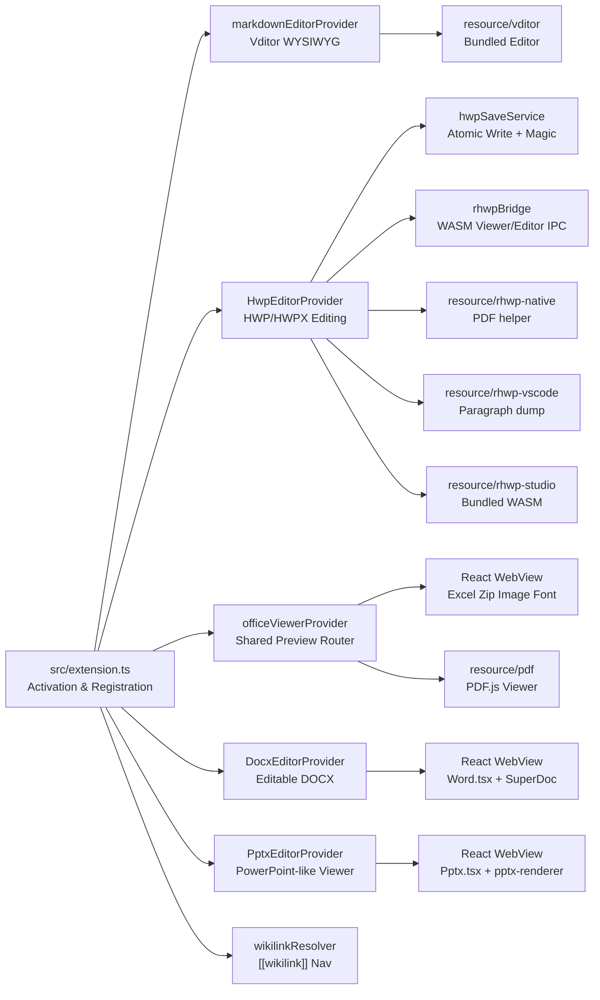

# code-office Structure Hub

`code-office` is an independent VS Code extension that brings local HWP/HWPX Viewer+Editor modes, SuperDoc-powered DOCX viewing/editing, WYSIWYG/Raw Markdown editing via Vditor, PowerPoint-like PPTX review, and read-only spreadsheet/PDF/image/font/archive previews into a single workspace. The extension is a ground-up restructuring of the abandoned `vscode-office` (cweijan → rjwang1982 fork) lineage, with local office document review and AI-era cross-format workflows as the primary new value.

This hub matters because the extension straddles three very different runtime surfaces. The **extension host** (`src/extension.ts` + `src/provider/*`) runs in VS Code's Node.js process and owns file I/O, lifecycle, and command dispatch. **WebView panels** (`src/react/*`) run in sandboxed Chromium iframes and own all visual rendering. **Bundled runtimes** (`resource/rhwp-studio`, `resource/vditor`, `resource/pdf`) are third-party assets patched at build time and loaded by the React app inside WebViews. A change in any surface can ripple into the other two, so the structure docs exist to make that impact radius explicit.

Snapshot note, 2026-06-27: current package version is `code-office@3.7.50` and the extension is distributed as `AGPL-3.0-or-later` after bundling SuperDoc. HWP/HWPX uses internal Viewer/Editor modes, native-first PDF export, Viewer `Cmd+F`/`Ctrl+F` highlighting, and rhwp Editor find routing on vendored rhwp `v0.7.13` (re-pin to `v0.7.16` decided in `devlog/_plan/260627_upstream_rhwp_chase/`; execution pending). DOCX uses `cweijan.docxEditor` with SuperDoc View/Edit modes and VS Code theme-aware chrome (`Word.css` dark-mode parity shipped in `v3.7.50`). PPTX uses `cweijan.pptxEditor` as a PowerPoint-like read-only viewer. Runtime `viewType` identifiers (`cweijan.officeViewer`, `cweijan.hwpEditor`, etc.) and most configuration keys (`vscode-office.*`) intentionally retain legacy strings for backward compatibility. New owned commands (`code-office.hwp.*`, `code-office.docx.save`) use the `code-office.*` prefix. Release trust includes tag-based GitHub Release artifacts, SHA-256 checksums, artifact attestations, registry publish from attested VSIX files, `docs/HWP-HWPX-COMPATIBILITY.md` (baseline `3.7.50`), and `docs/COMPETITIVE-CONTEXT.md`. Active upstream chase: rhwp re-pin execution (R2) and remaining SuperDoc viewer parity items in `devlog/_plan/260627_upstream_rhwp_chase/`.

Start here when onboarding. Read the system overview, then open `[[01-file-function-map]]` for concrete file locations. Use `[[02-extension-api]]` for VS Code integration surface work, `[[03-hwp-subsystem]]` for HWP/HWPX editing changes, `[[04-viewer-architecture]]` for viewer and Markdown editor changes, `[[05-build-release]]` for build/packaging/CI, and `[[06-devlog-map]]` for roadmap and archive interpretation.

---

## System Overview

The runtime path is layered by trust boundary. The extension host has full Node.js + VS Code API access and owns all disk I/O. WebView panels are sandboxed Chromium frames that communicate with the host only via `postMessage`. Bundled runtimes (rhwp-studio, Vditor, PDF.js) run inside those WebViews and are further restricted by Content Security Policy. The HWP subsystem adds an additional validation layer: every byte array crossing the WebView→Host boundary is checked against format-specific magic numbers before being written to disk.

## Reading Order

| Order | Document                     | Why to read it                                                   |
| ------: | ------------------------------ | ------------------------------------------------------------------ |
|     1 | `[[00-structure-hub]]`       | Understand the system flow and document map.                     |
|     2 | `[[01-file-function-map]]`   | Locate files, line counts, and module responsibilities.          |
|     3 | `[[02-extension-api]]`       | Understand commands, configuration, custom editors, keybindings. |
|     4 | `[[03-hwp-subsystem]]`       | Understand HWP/HWPX editing lifecycle, save, bridge, security.   |
|     5 | `[[04-viewer-architecture]]` | Understand office viewer routing, Markdown editor, React views.  |
|     6 | `[[05-build-release]]`       | Understand build pipeline, VSIX packaging, verification, CI.     |
|     7 | `[[06-devlog-map]]`          | Understand devlog folder structure, roadmap, and completed work.     |
|     8 | `07-wikilink-authoring-autocomplete-research` | Wikilink autocomplete design research (reference). |
|     9 | `[[08-git-commit-history]]`  | Era boundaries, release map, and last-1,000-commit summary.          |

## Document Map

| Document                    | Scope                                                                  | Update when                                                                                |
| ----------------------------- | ------------------------------------------------------------------------ | -------------------------------------------------------------------------------------------- |
| `00-structure-hub.md`       | Entry point, doc relationships, system overview                        | A doc is added, removed, renamed, or re-scoped.                                            |
| `01-file-function-map.md`   | File tree, line counts, responsibilities                               | Files move, large modules split, or line counts change.                                    |
| `02-extension-api.md`       | VS Code integration surface: commands, config, editors, keybindings    | `package.json` contributes, `extension.ts`, or any command/config changes.                 |
| `03-hwp-subsystem.md`       | HWP editing lifecycle, save service, rhwp bridge, message schema       | `src/provider/hwp/*`, `src/react/view/hwp/*`, or `src/common/hwpMessageSchema.ts` changes. |
| `04-viewer-architecture.md` | Office viewer routing, Markdown editor, React app, all view components | `officeViewerProvider.ts`, `markdownEditorProvider.ts`, `src/react/*` changes.             |
| `05-build-release.md`       | esbuild, rhwp post-processing, VSIX, verification scripts, CI          | `build.ts`, `scripts/*`, `.github/*`, `package.json` scripts changes.                      |
| `06-devlog-map.md`          | `_plan`, `_fin`, roadmap interpretation                                | Devlog folders move or the active roadmap changes.                                         |
| `07-wikilink-authoring-autocomplete-research.md` | Wikilink autocomplete research facts and external references | Wikilink authoring behavior or completion UX changes. |
| `08-git-commit-history.md`  | Last 1,000 commits: eras, releases, subsystem evolution, raw TSV path | Each `v*.*.*` release tag or major subsystem swap. |

## Public Evidence Documents

| Document | Purpose |
| --- | --- |
| `docs/HWP-HWPX-COMPATIBILITY.md` | Public HWP/HWPX support matrix and private fixture policy. |
| `docs/COMPETITIVE-CONTEXT.md` | Product positioning and competitor comparison guardrails. |
| `.github/workflows/release.yml` | Tag-triggered VSIX, checksum, and provenance artifact workflow. |

## Cross References

| Document                 | Should also check                                                |
| -------------------------- | ------------------------------------------------------------------ |
| `01-file-function-map`   | `02-extension-api`, `04-viewer-architecture`, `05-build-release` |
| `02-extension-api`       | `03-hwp-subsystem`, `04-viewer-architecture`                     |
| `03-hwp-subsystem`       | `02-extension-api`, `04-viewer-architecture`, `05-build-release` |
| `04-viewer-architecture` | `02-extension-api`, `03-hwp-subsystem`                           |
| `05-build-release`       | `01-file-function-map`, `03-hwp-subsystem`                       |
| `06-devlog-map`          | `00-structure-hub`, `direction.md`, `roadmap.md`, `08-git-commit-history` |

## Attribution

This extension is distributed under AGPL-3.0-or-later after bundling SuperDoc for DOCX rendering/editing. It remains derived from [`cweijan/vscode-office`](https://github.com/cweijan/vscode-office) (original) via [`rjwang1982/vscode-office`](https://github.com/rjwang1982/vscode-office) (maintained fork), both MIT licensed. HWP editing, viewing, search, and PDF helper paths use [`edwardkim/rhwp`](https://github.com/edwardkim/rhwp). Full attribution is in `NOTICE.md`.
