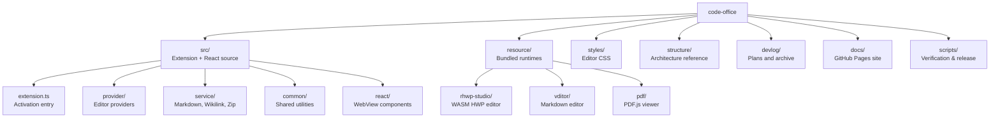

# File and Function Map

This document is a fast map of the current `code-office` file layout. Use it to understand which files own which responsibilities before making changes.

The map matters because runtime responsibility is split across three isolated surfaces: the Node.js extension host (`src/provider/*`, `src/service/*`, `src/common/*`), sandboxed Chromium WebViews (`src/react/*`), and bundled third-party runtimes (`resource/*`). A visual change may require edits in React components, but a data-flow change requires provider-level work. Reading responsibilities and line counts together reveals impact radius.

Snapshot note, 2026-05-30: line counts are from the TypeScript sources. `src/bundle/adm-zip/*` is a vendored JS library (not authored code) and is excluded from authored line counts.

---

## Top-Level Tree

## Extension Host — Source Files

### Core Entry

| File | Lines | Responsibility |
|---|---:|---|
| `src/extension.ts` | 168 | Activation entry: initializes services, registers providers, commands, wikilink completion |

### Provider Layer (`src/provider/`)

| File | Lines | Responsibility |
|---|---:|---|
| `provider/markdownEditorProvider.ts` | 223 | `CustomTextEditorProvider` wrapping Vditor; dual-mode (default + optional), handler binding, resource roots, config injection |
| `provider/officeViewerProvider.ts` | 131 | `CustomReadonlyEditorProvider` for ~20 file types; extension-based routing, PDF redirect, HTML hot-reload, HWP legacy redirect |
| `provider/hwp/HwpEditorProvider.ts` | 316 | `CustomEditorProvider<HwpCustomDocument>` with full dirty/save/revert/backup lifecycle, 120s export timeout, config cascading |
| `provider/hwp/hwpSaveService.ts` | 131 | Atomic file write (temp→rename), magic number validation (OLE/ZIP), size constraints, toolbar save dialog |
| `provider/hwp/HwpCustomDocument.ts` | ~30 | Document model holding initial buffer, uri, and dispose callback |
| `provider/handlers/hwpHandler.ts` | 122 | WebView↔Host event binding for HWP: init, dirtyChanged, nativeSave, vscodeSavePayload, requestSave |
| `provider/handlers/pptxHandler.ts` | 144 | PPTX parsing via AdmZip: slide order from rels XML, text extraction, base64 image embedding |
| `provider/handlers/imageHandler.ts` | 44 | Image gallery data: sibling file list, current index, refresh on file change |
| `provider/compress/commonHandler.ts` | ~40 | Shared archive handler utilities |
| `provider/compress/zipHandler.ts` | 79 | ZIP/JAR/APK/VSIX tree parsing and extraction |
| `provider/compress/rarHandler.ts` | 137 | RAR archive handling (separate path from zip) |
| `provider/compress/decompressHandler.ts` | ~50 | Common decompression logic |
| `provider/wikilink/wikilinkCompletionProvider.ts` | 37 | `CompletionItemProvider` for `[[` triggers: workspace file suggestions |
| `provider/wikilink/wikilinkDocumentLinkProvider.ts` | ~40 | `DocumentLinkProvider` for wikilink navigation in Markdown |

### Service Layer (`src/service/`)

| File | Lines | Responsibility |
|---|---:|---|
| `service/markdownService.ts` | 225 | Markdown export pipeline (PDF/HTML/DOCX via chromium), image paste handler, clipboard image save |
| `service/wikilink/wikilinkResolver.ts` | 235 | Wikilink resolution: workspace search, scoring by directory distance, heading/blockId navigation, QuickPick disambiguation |
| `service/wikilink/wikilinkParser.ts` | 89 | Regex parser for `[[target|alias#heading^blockId]]` + embed syntax |
| `service/pptx/libreOfficeConverter.ts` | 84 | Legacy `.ppt` → PDF conversion via LibreOffice CLI, 30s timeout |
| `service/zip/zipUtils.ts` | 103 | ZIP tree parser, recursive size computation, timestamp formatting |
| `service/markdown/ext/markdown-it-mermaid.ts` | ~50 | markdown-it plugin for Mermaid diagram rendering |
| `service/markdown/ext/markdown-it-katex.js` | ~40 | markdown-it plugin for KaTeX math rendering |
| `service/markdown/holder.ts` | ~30 | Markdown rendering state holder |
| `service/markdown/outline.js` | ~60 | Markdown heading outline extraction |
| `service/markdown/html-export.js` | ~80 | HTML export with asset inlining |
| `service/markdown/markdown-pdf.js` | ~100 | PDF export via puppeteer-core |
| `service/htmlService.ts` | ~50 | HTML file handling and preview |

### Common Layer (`src/common/`)

| File | Lines | Responsibility |
|---|---:|---|
| `common/hwpMessageSchema.ts` | 166 | 12 HWP event definitions, TypeScript payload interfaces, runtime validation with type guards |
| `common/reactApp.ts` | 135 | React WebView loader: dev mode (Vite HMR) vs production (bundled), CSP injection, asset path rewriting |
| `common/handler.ts` | 81 | `Handler` class: EventEmitter wrapper with bidirectional WebView messaging, auto-unsubscribe, error handling |
| `common/fileUtil.ts` | 61 | File I/O helpers: writeFile with mkdir, image path adjustment, workspace root resolution |
| `common/util.ts` | 37 | HTML path rewriting for WebView URIs, file change listener, confirm dialog |
| `common/global.ts` | 23 | Config getters/setters for `vscode-office.*` namespace |
| `common/Output.ts` | 24 | Lazy output channel "Office" for extension logging |

## WebView — React Source (`src/react/`)

### Entry and Routing

| File | Lines | Responsibility |
|---|---:|---|
| `react/main.tsx` | ~30 | React root with Ant Design ConfigProvider, lazy route-based component loading |
| `react/main.css` | ~20 | Global WebView CSS reset |
| `react/antThemeConfig.ts` | ~15 | Ant Design dark theme tokens |

### Utility

| File | Lines | Responsibility |
|---|---:|---|
| `react/util/vscode.ts` | ~40 | WebView↔Host message handler: `handler.on()` / `handler.emit()` |
| `react/util/vscodeConfig.ts` | ~30 | Config injection reader: parses `data-config` HTML attribute |
| `react/util/reactUtils.ts` | ~20 | Shared React utility hooks |

### View Components

| Component | File | Lines | Renderer |
|---|---|---:|---|
| HWP Editor | `react/view/hwp/Hwp.tsx` | ~280 | rhwp-studio WASM via iframe |
| HWP Bridge | `react/view/hwp/rhwpBridge/createSecureRhwpEditor.ts` | 463 | Dual-mode editor: local direct bridge / remote postMessage RPC |
| HWP Types | `react/view/hwp/rhwpBridge/types.ts` | 37 | Interface definitions for bridge |
| HWP Validator | `react/view/hwp/rhwpBridge/validateRhwpMessage.ts` | ~40 | Message validation for rhwp bridge |
| Excel | `react/view/excel/Excel.tsx` | ~80 | x-data-spreadsheet + xlsx parser |
| Excel Reader | `react/view/excel/excel_reader.ts` | 214 | XLSX→x-spreadsheet data converter |
| Excel Writer | `react/view/excel/excel_writer.ts` | 80 | x-spreadsheet data→XLSX exporter |
| Word | `react/view/word/Word.tsx` | ~60 | docx-preview HTML renderer |
| PPTX | `react/view/pptx/Pptx.tsx` | ~90 | Slide carousel with thumbnails |
| Image | `react/view/image/Image.tsx` | ~40 | react-image-gallery |
| ZIP | `react/view/compress/Zip.tsx` | ~60 | Tree view with extract/add/remove |
| Font | `react/view/fontViewer/FontViewer.tsx` | ~100 | opentype.js glyph inspector |

### Vendored: x-spreadsheet (`react/view/excel/x-spreadsheet/`)

Full vendored copy of `x-data-spreadsheet` with custom modifications. ~4,000 lines of JS. Not authored code — treat as a dependency.

## Bundled Resources (`resource/`)

| Directory | Contents | Loaded by |
|---|---|---|
| `resource/rhwp-studio/` | Post-processed WASM HWP editor (index.html + assets) | `HwpEditorProvider` via iframe |
| `resource/vditor/` | Vditor markdown editor bundle | `markdownEditorProvider` via WebView |
| `resource/pdf/` | PDF.js viewer (viewer.html + assets) | `officeViewerProvider` for .pdf files |
| `resource/lib/` | Shared JS libraries | Various providers |

## Build and Scripts

| File | Lines | Responsibility |
|---|---:|---|
| `build.ts` | 195 | esbuild config, dependency bundling, rhwp-studio post-processing (path rewrite, bridge injection, PWA strip) |
| `vite.config.ts` | ~30 | Vite config for React WebView dev/build |
| `tsconfig.json` | ~20 | TypeScript strict config |
| `scripts/verify-hwp-hardening.mjs` | ~100 | Release gate: HWP editor activation, provider methods, handler bindings |
| `scripts/verify-vsix.mjs` | ~80 | Release gate: VSIX structure, manifest, build artifacts |

## Authored Line Count Summary

| Surface | Lines | Notes |
|---|---:|---|
| Extension Host (providers + services + common) | ~2,500 | Node.js, VS Code API |
| React WebView (views + utils) | ~1,600 | Chromium, React 18 |
| Build + Scripts | ~400 | esbuild, verification |
| **Total authored** | **~4,500** | Excludes vendored x-spreadsheet (~4k), adm-zip (~1k), bundled resources |
