# File and Function Map

This document is a fast map of the current `code-office` file layout. Use it to understand which files own which responsibilities before making changes.

The map matters because runtime responsibility is split across three isolated surfaces: the Node.js extension host (`src/provider/*`, `src/service/*`, `src/common/*`), sandboxed Chromium WebViews (`src/react/*`), and bundled third-party runtimes (`resource/*`). A visual change may require edits in React components, but a data-flow change requires provider-level work. Reading responsibilities and line counts together reveals impact radius.

Snapshot note, 2026-06-27: line counts are from `find src -type f \( -name '*.ts' -o -name '*.tsx' \) | wc -l` after HWP provider-state extraction, PPTX child-component split, ZIP compress UI modularization, font-viewer helper split, wikilink workspace index, DOCX `Word.css` VS Code theme vars (dark-mode page edge), and expanded docs/scripts gates. `src/bundle/adm-zip/*`, `src/react/view/excel/x-spreadsheet/*`, `src/test/*`, and `resource/*` are vendored/bundled/test surfaces and are excluded from authored line-count enforcement unless intentionally forked.

---

## Top-Level Tree

```mermaid
graph TD
    ROOT["code-office"] --> SRC["src/<br/>Extension + React source"]
    ROOT --> RES["resource/<br/>Bundled runtimes"]
    ROOT --> STYLES["styles/<br/>Editor CSS"]
    ROOT --> STRUCT["structure/<br/>Architecture reference"]
    ROOT --> DEVLOG["devlog/<br/>Plans and archive"]
    ROOT --> DOCS["docs/<br/>GitHub Pages site"]
    ROOT --> SCRIPTS["scripts/<br/>Verification & release"]
    ROOT --> TEST["src/test/<br/>Mechanical assertions"]
    ROOT --> FIXTURES["test-fixtures/<br/>Private QA fixtures"]
    ROOT --> NATIVE["native/<br/>rhwp-pdf-export source"]
    SRC --> EXT["extension.ts<br/>Activation entry"]
    SRC --> PROV["provider/<br/>Editor providers"]
    SRC --> SVC["service/<br/>Markdown, Wikilink, Zip"]
    SRC --> COMMON["common/<br/>Shared utilities"]
    SRC --> REACTSRC["react/<br/>WebView components"]
    RES --> RHWP["rhwp-studio/<br/>WASM HWP Viewer/Editor"]
    RES --> RHWPN["rhwp-native/<br/>PDF helper"]
    RES --> RHWPV["rhwp-vscode/<br/>paragraph dump media"]
    RES --> VDITOR["vditor/<br/>Markdown editor"]
    RES --> PDF["pdf/<br/>PDF.js viewer"]
```

## Extension Host — Source Files

### Core Entry

| File | Lines | Responsibility |
|---|---:|---|
| `src/extension.ts` | 219 | Activation entry: initializes services, registers providers, commands, wikilink completion |

### Provider Layer (`src/provider/`)

| File | Lines | Responsibility |
|---|---:|---|
| `provider/markdownEditorProvider.ts` | 290 | `CustomTextEditorProvider` wrapping Vditor; dual-mode (default + optional), handler binding, resource roots, config injection, wikilink cache payload push |
| `provider/officeViewerProvider.ts` | 122 | `CustomReadonlyEditorProvider` for shared preview surfaces; extension-based routing, PDF redirect, HTML hot-reload, HWP legacy redirect; DOCX/PPTX are handled by dedicated providers |
| `provider/hwp/HwpEditorProvider.ts` | 489 | `CustomEditorProvider<HwpCustomDocument>` with Viewer/Editor mode persistence, dirty save-then-view, SVG/PDF/debug/dump commands, pending RPC cleanup, full dirty/save/revert/backup lifecycle |
| `provider/hwp/hwpProviderState.ts` | 25 | HWP editor view type, RPC timeout constants, `lastMode` storage key, pending export/viewer-command promise types |
| `provider/docx/DocxEditorProvider.ts` | 219 | `CustomEditorProvider<DocxCustomDocument>` with editable DOCX open/save/saveAs/revert/backup lifecycle and webview save bridge |
| `provider/pptx/PptxEditorProvider.ts` | 62 | `CustomReadonlyEditorProvider<PptxCustomDocument>` for PPTX/PPTM/PPSX read-only viewer documents |
| `provider/hwp/hwpSaveService.ts` | 149 | Atomic file write (temp→rename), magic number validation (OLE/ZIP), size constraints, toolbar save dialog |
| `provider/hwp/HwpCustomDocument.ts` | 24 | Document model holding initial buffer, uri, and dispose callback |
| `provider/hwp/hwpParagraphDump.ts` | 97 | Host-side paragraph dump via vendored rhwp-vscode glue/WASM |
| `provider/hwp/hwpDebugOverlay.ts` | 23 | Debug overlay HTML builder for SVG page output |
| `provider/hwp/hwpPdfExportFlow.ts` | 47 | Native-first HWP PDF orchestration: one save dialog, dirty save, native helper, image fallback |
| `provider/hwp/hwpNativePdfExport.ts` | 69 | Host-side native helper launcher for rhwp SVG-to-PDF export |
| `provider/hwp/hwpPdfExport.ts` | 72 | Image PDF fallback from Viewer-rasterized PNG pages using `pdf-lib` |
| `provider/hwp/hwpStudioConfig.ts` | 45 | Local/remote rhwp-studio config resolution and bundled index loading |
| `provider/hwp/hwpSettings.ts` | 19 | `code-office.hwp.*` setting reader with legacy `vscode-obsidian.hwp.*` fallback |
| `provider/handlers/hwpHandler.ts` | 140 | WebView↔Host event binding for HWP: init, dirtyChanged, nativeSave, vscodeSavePayload, mode, viewer command events |
| `provider/handlers/docxHandler.ts` | 140 | WebView↔Host event binding for DOCX: buffer open, dirty state, save request/response bridge, host-save completion, lifecycle cleanup |
| `provider/handlers/pptxHandler.ts` | 32 | WebView↔Host event binding for PPTX: file URI open event and read-only viewer bridge cleanup |
| `provider/handlers/imageHandler.ts` | 44 | Image gallery data: sibling file list, current index, refresh on file change |
| `provider/compress/commonHandler.ts` | 36 | Shared archive handler utilities |
| `provider/compress/zipHandler.ts` | 79 | ZIP/JAR/APK/VSIX tree parsing and extraction |
| `provider/compress/rarHandler.ts` | 137 | RAR archive handling (separate path from zip) |
| `provider/compress/decompressHandler.ts` | 29 | Common decompression logic |
| `provider/wikilink/wikilinkCompletionProvider.ts` | 37 | `CompletionItemProvider` for `[[` triggers: workspace file suggestions |
| `provider/wikilink/wikilinkDocumentLinkProvider.ts` | 21 | `DocumentLinkProvider` for wikilink navigation in Markdown |

### Service Layer (`src/service/`)

| File | Lines | Responsibility |
|---|---:|---|
| `service/markdownService.ts` | 240 | Markdown export pipeline (PDF/HTML/DOCX via chromium), image paste handler, clipboard image save |
| `service/wikilink/wikilinkResolver.ts` | 366 | Wikilink resolution: index-backed Markdown candidate listing, scoring by directory distance, heading/blockId navigation, QuickPick disambiguation |
| `service/wikilink/wikilinkIndex.ts` | 133 | Workspace Markdown file index with FS watcher; folder-scoped basename cache for completion/resolver |
| `service/wikilink/wikilinkParser.ts` | 120 | Regex parser for `[[target|alias#heading^blockId]]` + embed syntax |
| `service/pptx/libreOfficeConverter.ts` | 84 | Legacy `.ppt` → PDF conversion via LibreOffice CLI, 30s timeout |
| `service/zip/zipUtils.ts` | 103 | ZIP tree parser, recursive size computation, timestamp formatting |
| `service/markdown/ext/markdown-it-mermaid.ts` | ~50 | markdown-it plugin for Mermaid diagram rendering |
| `service/markdown/ext/markdown-it-katex.js` | ~40 | markdown-it plugin for KaTeX math rendering |
| `service/markdown/holder.ts` | ~30 | Markdown rendering state holder |
| `service/markdown/outline.js` | ~60 | Markdown heading outline extraction |
| `service/markdown/html-export.js` | 188 | HTML export with asset inlining |
| `service/markdown/markdown-pdf.js` | 341 | PDF export via puppeteer-core |
| `service/htmlService.ts` | 29 | HTML file handling and preview |

### Common Layer (`src/common/`)

| File | Lines | Responsibility |
|---|---:|---|
| `common/hwpMessageSchema.ts` | 272 | HWP event definitions for save, mode switching, viewer commands, PDF page payloads, TypeScript payload interfaces, runtime validation with type guards |
| `common/hwpSvgSanitizer.ts` | 43 | Conservative SVG sanitizer for rhwp Viewer/debug output |
| `common/reactApp.ts` | 136 | React WebView loader: dev mode (Vite HMR) vs production (bundled), CSP injection, asset path rewriting |
| `common/handler.ts` | 84 | `Handler` class: EventEmitter wrapper with bidirectional WebView messaging, auto-unsubscribe, error handling |
| `common/fileUtil.ts` | 61 | File I/O helpers: writeFile with mkdir, image path adjustment, workspace root resolution |
| `common/util.ts` | 37 | HTML path rewriting for WebView URIs, file change listener, confirm dialog |
| `common/global.ts` | 23 | Config getters/setters for `vscode-office.*` namespace |
| `common/Output.ts` | 24 | Lazy output channel "Office" for extension logging |

## WebView — React Source (`src/react/`)

### Entry and Routing

| File | Lines | Responsibility |
|---|---:|---|
| `react/main.tsx` | 47 | React root with Ant Design ConfigProvider, lazy route-based component loading |
| `react/main.css` | ~20 | Global WebView CSS reset |
| `react/antThemeConfig.ts` | 13 | Ant Design compact sizing tokens (control height, button padding) |

### Utility

| File | Lines | Responsibility |
|---|---:|---|
| `react/util/vscode.ts` | 36 | WebView↔Host message handler: `handler.on()` / `handler.emit()` |
| `react/util/vscodeConfig.ts` | 24 | Config injection reader: parses `data-config` HTML attribute |
| `react/util/reactUtils.ts` | 13 | Shared React utility hooks (e.g. `useWindowSize`) |
| `react/view/vscode.tsx` | 27 | Floating VS Code logo overlay; emits `editInVSCode` to host |

### View Components

| Component | File | Lines | Renderer |
|---|---|---:|---|
| HWP Controller | `react/view/hwp/Hwp.tsx` | 495 | Viewer/Editor state machine, save-then-view gating, host command RPC, find shortcut routing |
| HWP Viewer | `react/view/hwp/HwpViewer.tsx` | 151 | Viewer toolbar, page SVG list, Viewer search UI, developer menu |
| HWP Editor Surface | `react/view/hwp/HwpEditorSurface.tsx` | 49 | Editor toolbar and rhwp mount surface |
| HWP Find Helpers | `react/view/hwp/hwpFind.ts` | 318 | Cmd/Ctrl+F detection, Viewer SVG/rhwp text search, SVG hit decoration, rhwp editor find activation and Enter routing |
| HWP Viewer Search Hook | `react/view/hwp/useHwpViewerSearch.ts` | 32 | Memoized Viewer search result resolution that prefers highlightable SVG text and falls back to rhwp text search |
| HWP PDF Rasterizer | `react/view/hwp/hwpPdfPages.ts` | 82 | Converts sanitized Viewer SVG pages to PNG payloads for image-PDF fallback |
| HWP Bridge | `react/view/hwp/rhwpBridge/createSecureRhwpEditor.ts` | 479 | Dual-mode editor: local direct bridge / remote postMessage RPC |
| HWP Studio URLs | `react/view/hwp/rhwpBridge/localStudioResources.ts` | 21 | Srcdoc HTML base-URL rewrite and `./` asset resolution for bundled rhwp-studio |
| HWP SVG Export | `react/view/hwp/rhwpBridge/exportSvgPages.ts` | 35 | Shared pageCount/getPageSvg/debug overlay export helper |
| HWP Types | `react/view/hwp/rhwpBridge/types.ts` | 41 | Interface definitions for bridge |
| HWP Validator | `react/view/hwp/rhwpBridge/validateRhwpMessage.ts` | 11 | Message validation for rhwp bridge |
| Excel | `react/view/excel/Excel.tsx` | 79 | x-data-spreadsheet + xlsx parser |
| Excel Reader | `react/view/excel/excel_reader.ts` | 214 | XLSX→x-spreadsheet data converter |
| Excel Writer | `react/view/excel/excel_writer.ts` | 80 | x-spreadsheet data→XLSX exporter |
| Word Coordinator | `react/view/word/Word.tsx` | 346 | SuperDoc DOCX View/Edit coordinator: document buffer state, mode switching, host event orchestration, and composition of focused DOCX helpers/components |
| Word Shell CSS | `react/view/word/Word.css` | 261 | DOCX chrome/toolbar/warning/backdrop/status using `var(--vscode-*)`; paper-white page; `body.vscode-dark` page hairline |
| Word Surface | `react/view/word/SuperDocSurface.tsx` | 133 | SuperDoc mount surface: stable editor props, font resolution, render status placement, and SuperDoc event pass-through |
| Word Toolbar/States | `react/view/word/DocxModeToolbar.tsx`, `DocxLoadState.tsx` | 37 / 28 | DOCX mode controls, save button, loading/empty/error states |
| Word Hooks | `react/view/word/useDocxHostSave.ts`, `useDocxKeyboardSave.ts`, `useDocxRenderTimeout.ts` | 64 / 23 / 20 | Host-save request/waiter lifecycle, Cmd/Ctrl+S handling, render timeout warning |
| Word Save Repair | `react/view/word/docxSaveRepair.ts` | 147 | JSZip/XML paragraph patching when SuperDoc export misses visible edits |
| Word DOCX Helpers | `react/view/word/docxExport.ts`, `docxSnapshot.ts`, `docxText.ts`, `docxConstants.ts`, `docxTypes.ts`, `docxRuntimeUtils.ts`, `docxSaveValidation.ts`, `superdocFonts.ts`, `superdocExceptions.ts`, `superdocZoom.ts` | ≤85 each | SuperDoc export strategies, text snapshots, validation, font URLs, exception filtering, zoom |
| PPTX Coordinator | `react/view/pptx/Pptx.tsx` | 476 | PowerPoint-like read-only viewer: sidebar, notes, grid, fullscreen, presenter view, keyboard navigation, zoom |
| PPTX Thumbnail | `react/view/pptx/SlideThumbnail.tsx` | 110 | Per-slide thumbnail render via `@aiden0z/pptx-renderer` |
| PPTX Presenter Chrome | `react/view/pptx/PptxPresenterChrome.tsx` | 100 | Presenter-view layout chrome and controls |
| PPTX Status Bar | `react/view/pptx/PptxStatusBar.tsx` | 86 | Slide index, title, zoom, and mode indicators |
| PPTX Metadata | `react/view/pptx/pptxMetadata.ts` | 83 | JSZip slide/notes XML parse for titles and speaker notes |
| Image | `react/view/image/Image.tsx` | 38 | react-image-gallery |
| ZIP Coordinator | `react/view/compress/Zip.tsx` | 60 | Archive tree shell; composes compress child components |
| ZIP Table | `react/view/compress/components/FileItems.tsx` | 70 | Ant Design table for archive entries with open/extract/delete |
| ZIP Sidebar | `react/view/compress/components/Sidebar.tsx` | 53 | Archive tree navigation sidebar |
| ZIP Toolbar | `react/view/compress/components/Toolbar.tsx` | 47 | Extract/add/remove archive actions |
| ZIP Types | `react/view/compress/zipTypes.ts` | 23 | `FileInfo` and archive entry types |
| Font Viewer | `react/view/fontViewer/FontViewer.tsx` | 100 | opentype.js glyph grid UI |
| Font Loader | `react/view/fontViewer/fontViewerMain.ts` | 72 | WOFF2 decompress + opentype parse + glyph metrics |

### Vendored: x-spreadsheet (`react/view/excel/x-spreadsheet/`)

Full vendored copy of `x-data-spreadsheet` with custom modifications. ~4,000 lines of JS. Not authored code — treat as a dependency.

## Bundled Resources (`resource/`)

| Directory | Contents | Loaded by |
|---|---|---|
| `resource/rhwp-studio/` | Post-processed WASM HWP editor (`index.html`, hashed `assets/`, Korean font bundle, sample HWPs, workbox SW) | `HwpEditorProvider` via iframe |
| `resource/rhwp-vscode/` | Matched rhwp-vscode `rhwp.js` + `rhwp_bg.wasm` media pair | Host-side paragraph dump |
| `resource/rhwp-native/` | Platform-native `rhwp-pdf-export` helper binaries (`darwin-arm64/`, …) | Native-first HWP/HWPX PDF export |
| `resource/vditor/` | Vditor markdown editor bundle (`dist/`, themes, i18n) | `markdownEditorProvider` via WebView |
| `resource/pdf/` | PDF.js viewer (`viewer.html`, locale, images) | `officeViewerProvider` for .pdf files |
| `resource/lib/` | `vscode.js` WebView bridge + `context_material.min.css` | Various providers |

Top-level build inputs (not shipped in VSIX `resource/`):

| Directory | Contents | Used by |
|---|---|---|
| `native/rhwp-pdf-export/` | Native PDF helper source/build tree | `scripts/build-rhwp-native-pdf.mjs` → `resource/rhwp-native/` |
| `vendor/rhwp-studio-dist/` | Upstream rhwp-studio dist input | `build.ts` post-process → `resource/rhwp-studio/` |
| `vditor/` | Vditor git submodule / upstream source | Copied/built into `resource/vditor/` |

## Build and Scripts

| File | Lines | Responsibility |
|---|---:|---|
| `build.ts` | 229 | esbuild config, dependency bundling, rhwp-studio post-processing (path rewrite, bridge injection, SVG/debug/search bridge, PWA strip) |
| `vite.config.ts` | ~30 | Vite config for React WebView dev/build |
| `tsconfig.json` | ~20 | TypeScript strict config |
| `scripts/verify-hwp-hardening.mjs` | 248 | Release gate: HWP editor activation, provider methods, mode/viewer command wiring, find routing, PDF/export paths, handler bindings |
| `scripts/verify-vsix.mjs` | 208 | Release gate: package metadata, README/GitHub Pages coverage, VSIX structure, native helper, manifest, build artifacts |
| `scripts/verify-hwp-compatibility-matrix.mjs` | 143 | Gate: `docs/HWP-HWPX-COMPATIBILITY.md` + `test-fixtures/hwp/` policy/manifest alignment |
| `scripts/audit-phase06-1.mjs` | 174 | Dependency audit attestation for esbuild/file-type/superdoc advisories |
| `scripts/docx-word-parity-fixtures.mjs` | 83 | Local DOCX parity fixture manifest helper (private paths, not committed) |
| `scripts/build-rhwp-native-pdf.mjs` | 25 | Build `native/rhwp-pdf-export` into `resource/rhwp-native/` |
| `scripts/package-openvsx.mjs` | 71 | Open VSX packaging wrapper |
| `scripts/publish-openvsx.mjs` | 37 | Open VSX publish wrapper |

## Documentation (`docs/`)

| File | Lines | Responsibility |
|---|---:|---|
| `docs/ARCHITECTURE.md` | 96 | Trust boundaries: extension host vs webview vs bundled runtimes |
| `docs/CONTRIBUTING.md` | 158 | Contributor setup, build, verification gates |
| `docs/TESTING.md` | 107 | Test/fixture policy and verification commands |
| `docs/FAQ.md` | 207 | User-facing FAQ (English) |
| `docs/FAQ.ko.md` | 119 | User-facing FAQ (Korean) |
| `docs/HWP-HWPX-COMPATIBILITY.md` | 85 | HWP/HWPX compatibility matrix referenced by release gates |
| `docs/COMPETITIVE-CONTEXT.md` | 55 | Product positioning notes |
| `docs/index.html`, `docs/*.css`, `docs/assets/` | — | GitHub Pages site shell |

## Mechanical Tests (`src/test/`)

Node assertion scripts (not VS Code test runner). Run via `npm test` / package scripts.

| Pattern | Examples | Responsibility |
|---|---|---|
| `*Test.mjs` / `*Assertions.mjs` | `wikilinkResolverTest.mjs`, `docxEditorProviderSaveAssertions.mjs`, `pptxPhase4Test.mjs` | Source-structure and behavior contracts for wikilink, DOCX, PPTX, markdown, HWP, zip |
| `fixtures/` | `markdown-live-raw.md`, `phase5-cjk-inline.md` | Small inline markdown fixtures |

## Authored Line Count Summary

| Surface | Lines | Notes |
|---|---:|---|
| Extension Host (providers + services + common) | ~4,400 | Node.js, VS Code API |
| React WebView (views + utils + CSS) | ~5,300 | Chromium, React 18; includes `Word.css` |
| Build + Scripts | ~1,200 | esbuild, verification, Open VSX |
| **Total authored** | **~10,900** | Excludes vendored x-spreadsheet, adm-zip, `src/test/*`, and bundled `resource/*` |

### Files >100 lines (authored `src/` only)

| Lines | File |
|---:|---|
| 495 | `src/react/view/hwp/Hwp.tsx` |
| 489 | `src/provider/hwp/HwpEditorProvider.ts` |
| 479 | `src/react/view/hwp/rhwpBridge/createSecureRhwpEditor.ts` |
| 476 | `src/react/view/pptx/Pptx.tsx` |
| 366 | `src/service/wikilink/wikilinkResolver.ts` |
| 346 | `src/react/view/word/Word.tsx` |
| 318 | `src/react/view/hwp/hwpFind.ts` |
| 290 | `src/provider/markdownEditorProvider.ts` |
| 272 | `src/common/hwpMessageSchema.ts` |
| 240 | `src/service/markdownService.ts` |
| 219 | `src/provider/docx/DocxEditorProvider.ts` |
| 219 | `src/extension.ts` |
| 214 | `src/react/view/excel/excel_reader.ts` |
| 151 | `src/react/view/hwp/HwpViewer.tsx` |
| 149 | `src/provider/hwp/hwpSaveService.ts` |
| 147 | `src/react/view/word/docxSaveRepair.ts` |
| 140 | `src/provider/handlers/hwpHandler.ts` |
| 140 | `src/provider/handlers/docxHandler.ts` |
| 137 | `src/provider/compress/rarHandler.ts` |
| 136 | `src/common/reactApp.ts` |
| 133 | `src/service/wikilink/wikilinkIndex.ts` |
| 133 | `src/react/view/word/SuperDocSurface.tsx` |
| 122 | `src/provider/officeViewerProvider.ts` |
| 120 | `src/service/wikilink/wikilinkParser.ts` |
| 110 | `src/react/view/pptx/SlideThumbnail.tsx` |
| 103 | `src/service/zip/zipUtils.ts` |
| 100 | `src/react/view/pptx/PptxPresenterChrome.tsx` |
| 100 | `src/react/view/fontViewer/FontViewer.tsx` |

## Current Structural Watchlist

| File | Lines | Reason |
|---|---:|---|
| `src/react/view/hwp/Hwp.tsx` | 495 | Near the hard limit; keep new HWP UI in child modules. |
| `src/provider/hwp/HwpEditorProvider.ts` | 489 | Near the hard limit; `hwpProviderState.ts` already extracted pending-RPC types. |
| `src/react/view/hwp/rhwpBridge/createSecureRhwpEditor.ts` | 479 | Near the hard limit; future bridge behavior should stay in leaf helpers. |
| `src/react/view/pptx/Pptx.tsx` | 476 | Near the limit; thumbnails/status/presenter already split — keep new UI in child components. |
| `src/react/view/word/docxSaveRepair.ts` | 147 | Largest DOCX helper leaf; further save-repair logic should split by concern. |
