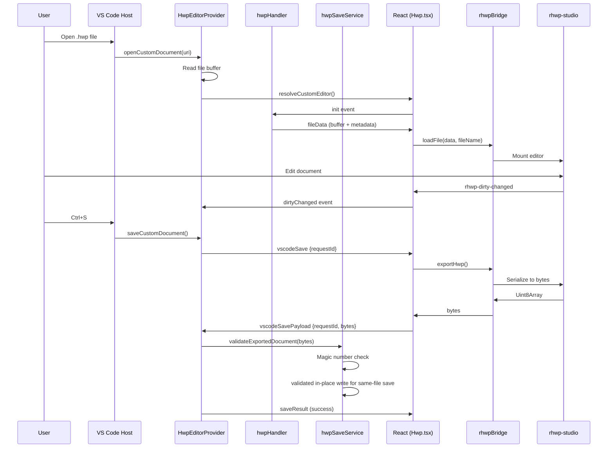

# HWP/HWPX Editing Subsystem

This document covers the full HWP/HWPX stack: the `HwpEditorProvider` lifecycle, internal Viewer/Editor mode switching, the `hwpSaveService` write policy, the `hwpMessageSchema` event protocol, the React `Hwp` controller, and the `rhwpBridge` that connects the WASM runtime to the VS Code host.

The HWP subsystem matters because it is the highest-complexity and highest-risk surface in the extension. A bug in the save path can corrupt irreplaceable government documents. A bug in the WebView↔Host boundary can silently drop edits. The architecture is intentionally defensive: every exported byte array is validated against format magic numbers, same-file VS Code saves write in place to avoid custom-editor rename churn, Save As/backup/toolbar fallback saves use temp-file atomic writes, and the 120-second export timeout prevents indefinite hangs from freezing VS Code.

---

 [[04-viewer-architecture.md]]

## Architecture Overview



## Provider Lifecycle

### `HwpEditorProvider` (`src/provider/hwp/HwpEditorProvider.ts`)

Implements `vscode.CustomEditorProvider<HwpCustomDocument>` with all five lifecycle methods:


| Method                               | Purpose                                         |
| -------------------------------------- | ------------------------------------------------- |
| `openCustomDocument(uri)`            | Load file buffer, create`HwpCustomDocument`     |
| `resolveCustomEditor(doc, panel)`    | Set up WebView, bind Handler, load rhwp-studio  |
| `saveCustomDocument(doc)`            | Request export → validate → in-place same-file write |
| `revertCustomDocument(doc)`          | Re-read disk → validate → reload WebView      |
| `backupCustomDocument(doc, context)` | Export → fallback to disk read → write backup |

Provider constants and pending request state types live in
`src/provider/hwp/hwpProviderState.ts` so the lifecycle provider can stay below
the dev-skill file-length threshold without changing save or viewer command
behavior.

### Viewer / Editor Mode

HWP/HWPX still uses the existing `cweijan.hwpEditor` custom editor view type. The extension does not register a separate `rhwp.hwpViewer`; mode is internal state on `HwpCustomDocument`.

Mode policy:

- First open defaults to `viewer`.
- User-selected `viewer` or `editor` mode is persisted in `context.globalState` under `code-office.hwp.lastMode`.
- `HWP/HWPX: Switch to Viewer` and the Viewer toolbar both route through `hwp:modeChangeRequest`.
- Clean Editor → Viewer renders SVG pages immediately.
- Dirty Editor → Viewer triggers the normal VS Code custom editor save lifecycle first. `hwp:modeChanged` is emitted only after `saveResult.success`.
- Save failure, cancellation, or timeout leaves the document in Editor and does not update last mode.
- Clean Viewer `Cmd+S` / `Ctrl+S` is a host no-op; it does not request export and cannot open a browser/Finder save dialog.

### Export Request Flow (Request/Response Pattern)

The save path cannot be synchronous because the WASM editor runs inside a sandboxed WebView iframe. The provider uses a **pending-export Map** pattern:

1. Generate unique `requestId` (timestamp + random suffix)
2. Store `{resolve, reject}` in `pendingExports` Map keyed by `requestId`
3. Post `HWP_EVENTS.vscodeSave` message to WebView with `{requestId, format}`
4. Start 120-second timeout (`EXPORT_TIMEOUT_MS = 120000`)
5. WebView calls `exportHwp()` or `exportHwpx()` on the bridge
6. Bridge returns `Uint8Array` → WebView converts to `number[]`
7. WebView posts `HWP_EVENTS.vscodeSavePayload` with `{requestId, success, bytes, format}`
8. Handler resolves the pending promise → provider continues with validated write
9. On timeout or cancel → promise rejects → VS Code shows error, no write occurs

### Configuration Cascading

HWP settings use a multi-level resolution that supports per-language and per-folder overrides:

```
Workspace Folder + Language → Workspace → Global + Language → Global → Default
```

Legacy `vscode-obsidian.hwp.*` keys are checked as fallback at each level.

---

## Save Service

### `hwpSaveService.ts` (`src/provider/hwp/hwpSaveService.ts` — 149 lines)

#### Magic Number Validation

Every byte array is checked before write:


| Format     | Magic Bytes                | Meaning                     |
| ------------ | ---------------------------- | ----------------------------- |
| HWP (OLE)  | `[0xd0, 0xcf, 0x11, 0xe0]` | MS Compound Document header |
| HWPX (ZIP) | `[0x50, 0x4b, 0x03, 0x04]` | ZIP local file header       |

Additional checks:

- **Empty export detection**: Rejects zero-length byte arrays
- **Size cap**: 50 MB maximum per file
- **Format mismatch**: Refuses to write HWPX bytes to a `.hwp` path (and vice versa)

#### Write Policy

Same-file VS Code saves and Save As-style writes intentionally use different disk policies:

- **Same-file `saveCustomDocument`**: validate exported bytes, then write in place to the original URI. This avoids rename churn in VS Code's custom editor lifecycle.
- **Save As, backup, and toolbar fallback writes**: validate exported bytes, then use a temp-file atomic rename path.

#### Atomic Write (`atomicWriteFile`)

```
1. Write bytes → ${targetUri}.tmp-${Date.now()}
2. On success → vscode.workspace.fs.rename(tmp, target, {overwrite: true})
3. On failure → attempt to delete tmp file, then rethrow
```

This prevents partial writes for Save As, backup, and toolbar fallback writes: if the process crashes mid-write, only the `.tmp-*` file is corrupted; the original file is untouched.

#### Toolbar Save Dialog

When the user clicks the toolbar Save button (experimental feature):

1. **Format conversion**: If source is `.hwpx` but export format is `hwp`, suggest `filename.converted.hwp`
2. **Mismatch warning**: If the export format doesn't match the file extension, warn and offer choices
3. **Collision detection**: If the target path already exists, show "Overwrite" or "Choose Another File" dialog

---

## Message Schema

### `hwpMessageSchema.ts` (`src/common/hwpMessageSchema.ts`)

Defines typed events for the WebView↔Host boundary:


| Event                   | Direction     | Payload                                                                     |
| ------------------------- | --------------- | ----------------------------------------------------------------------------- |
| `hwp:init`              | React → Host | Editor ready signal                                                         |
| `hwp:fileData`          | Host → React | `{fileName, buffer, fileSize, isHwpx, studioHtml?, studioBaseUrl?, error?}` |
| `hwp:requestSave`       | React → Host | `{bytes, format}` — toolbar save                                           |
| `hwp:saveResult`        | Host → React | `{success, error?}`                                                         |
| `hwp:dirtyChanged`      | React → Host | `{dirty: boolean}`                                                          |
| `hwp:nativeSave`        | React → Host | Ctrl+S detected in WebView                                                  |
| `hwp:vscodeSave`        | Host → React | `{requestId, format}` — request export                                     |
| `hwp:vscodeSavePayload` | React → Host | `{requestId, success, bytes?, format?, error?}`                             |
| `hwp:modeChangeRequest` | Host → React | `{mode}` — request Viewer/Editor switch                                    |
| `hwp:modeChanged`       | React → Host | `{mode}` — committed mode after successful transition                       |
| `hwp:viewerCommandRequest` | React → Host | `{command}` — Viewer toolbar asks host to run export/debug command       |
| `hwp:viewerCommand`     | Host → React | `{requestId, command}` — host requests SVG/debug payload                    |
| `hwp:viewerCommandResult` | React → Host | `{requestId, command, success, svgs?, error?}`                            |
| `hwp:reloadFile`        | Host → React | Revert: reload from disk                                                    |
| `hwp:error`             | Bidirectional | `{message, code?}`                                                          |

### Runtime Validation

`validateHwpPayload(type, payload)` performs type guards with runtime checks:

- Byte arrays must be `Array<number>` with values in `[0, 255]`
- Non-empty requirement for export payloads
- Format enum must be `'hwp'` or `'hwpx'`
- Conditional validation: success path requires `bytes`, error path only needs `error`

Invalid payloads are rejected with an error postMessage before they reach the EventEmitter. This guards against type injection from compromised or buggy WebView content.

---

## React Component

### `Hwp.tsx` (`src/react/view/hwp/Hwp.tsx` — 400 lines)

State machine:

```
LOADING → (fileData) → VIEWER
VIEWER → (Edit) → EDITOR
EDITOR clean → (View) → VIEWER
EDITOR dirty → (View) → SAVING → (save success) → VIEWER
EDITOR dirty → (View) → SAVING → (save fail/cancel/timeout) → EDITOR
```

Key behaviors:

- **Keyboard shortcuts**: Intercepts `Ctrl+S`/`Cmd+S` → emits `HWP_EVENTS.nativeSave`
- **Dirty tracking**: Listens for `rhwp-dirty-changed` CustomEvent → forwards to host
- **Export pipeline**: Calls `editorRef.current.exportHwp()` → converts `ArrayBuffer` → `number[]` → posts `vscodeSavePayload`
- **Viewer rendering**: Uses `pageCount()` + `getPageSvg(page)` through the secure rhwp bridge
- **SVG sanitization**: All Viewer/debug SVG strings pass through `sanitizeHwpSvg()` before `dangerouslySetInnerHTML` or debug overlay HTML
- **Viewer export commands**: PDF/SVG export and debug overlay use host-command RPC; PDF export is native-first through `resource/rhwp-native/<platform>-<arch>/rhwp-pdf-export`, then falls back to rasterizing sanitized Viewer SVG pages in the webview and assembling the PDF in the extension host with `pdf-lib`
- **Developer commands**: paragraph dump runs in the extension host with the vendored `resource/rhwp-vscode` glue/WASM pair
- **Error boundary**: Displays inline error with reload action on fatal bridge failure

---

## rhwp Bridge

### `createSecureRhwpEditor.ts` (`src/react/view/hwp/rhwpBridge/createSecureRhwpEditor.ts`)

Dual-mode editor creation:

#### Local Mode (Bundled Studio — Default)

```
iframe.srcdoc = studioHtml (patched by build.ts)
       ↓
window.__rhwpBridge = {ready, loadFile, pageCount, getPageSvg, setDebugOverlay, exportHwp, exportHwpx, markClean}
       ↓
Direct function calls via contentWindow.__rhwpBridge
```

`src/react/view/hwp/rhwpBridge/localStudioResources.ts` owns the local studio
srcdoc/base URL rewriting helpers. Keeping those helpers outside
`createSecureRhwpEditor.ts` leaves the bridge file focused on editor creation,
request routing, timeout handling, and cleanup.

#### Paragraph Dump Snapshot Rule

`HWP/HWPX: Dump Paragraph` reads the saved file from disk using the vendored rhwp-vscode media pair. If the same URI is open and dirty, the provider refuses the dump with a save-first error. This keeps the developer command from presenting stale disk metadata as if it were the unsaved editor state.

No origin validation needed because the iframe runs from `srcdoc` (same-origin null).

#### Remote Mode (Trusted URL)

```
iframe.src = studioUrl (user-configured)
       ↓
postMessage RPC with security token
       ↓
Origin validation against configured allowlist
       ↓
15s ready timeout, 30s per-request timeout
```

Used when `code-office.hwp.studioUrl` is set. The bridge generates a unique token and includes it in every RPC message. Responses must include the matching token to be accepted.

### Interface

```typescript
interface SecureRhwpEditor {
    loadFile(data: { buffer: number[], fileName: string }): void
    exportHwp(): Promise<Uint8Array>
    exportHwpx(): Promise<Uint8Array>
    destroy(): void
}
```

---

## Security Boundaries


| Boundary                 | Protection                                                                       |
| -------------------------- | ---------------------------------------------------------------------------------- |
| WebView → Host          | `hwpMessageSchema` validation rejects malformed payloads                         |
| Host → Disk             | Magic number check + size cap + in-place same-file write or atomic Save As/backup write |
| Remote Studio → WebView | Token-based RPC + origin allowlist + CSP frame-src                               |
| WebView → Filesystem    | `localResourceRoots` restricts to extension dir, document folder, global storage |
| User → Extension        | Format mismatch dialog, collision detection, empty export rejection              |

---

## rhwp Upstream Tracking

The HWP/HWPX runtime is a **vendored local build of [edwardkim/rhwp](https://github.com/edwardkim/rhwp)** (Rust + WASM, MIT). It is not pulled live; `vendor/rhwp-studio-dist/VERSION.md` is the authoritative pin and `resource/rhwp-studio` is the packaged bundle.

| Field | Value |
| --- | --- |
| Upstream | `edwardkim/rhwp` |
| Pinned base tag | `v0.7.13` (runtime) |
| Re-pin decision (R1, 2026-06-27) | **RE-PIN to `v0.7.16`** — execution pending in `devlog/_plan/260627_upstream_rhwp_chase/` |
| Pinned base commit | `b3e16ef212af81ef37d973ddb86d6816d3804642` (tagged 2026-05-26) |
| Local patch commit | `f887dca46fee37383012625a9227b3c599545a36` (find-dialog Enter capture; upstream PR #1281) |
| Wrapper package ref | `@rhwp/editor@0.7.13` |
| Vendored/built | 2026-06-03 |

### Commit gap (assessed 2026-06-27)

- Latest upstream release: **`v0.7.17`** (2026-06-22).
- Behind by **4 releases** (`v0.7.14` 2026-06-04, `v0.7.15` 2026-06-06, `v0.7.16` 2026-06-19, `v0.7.17` 2026-06-22).
- Release-tag gap `v0.7.13...v0.7.17` = **1387 commits**; default branch gap from the pinned base = **1455 commits** (0 behind — purely ahead).
- Visible upstream theme since `v0.7.13`: text/glyph rendering correctness (font-proof gates). Re-assess `feat`/`fix(save|export|render)` before any re-pin.

To re-pin: follow the step-by-step procedure in `devlog/_plan/260627_upstream_rhwp_chase/10_rhwp_catchup_playbook.md` (detect gap → decide → rebuild from the new tag + re-apply the find-dialog patch → verify → refresh this table). Chase backlog and SuperDoc (DOCX) parity live in `devlog/_plan/260627_upstream_rhwp_chase/00_overview.md`.
