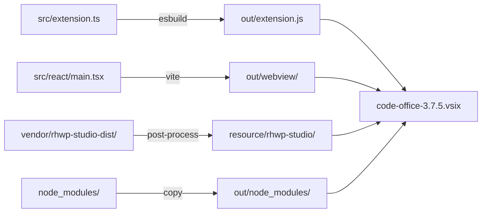

# Build Pipeline and Release

This document covers the esbuild-based build pipeline, the rhwp-studio post-processing step, VSIX packaging, verification scripts, and the release gate process.

The build pipeline matters because it has a non-trivial post-processing phase that patches the bundled rhwp-studio WASM editor for WebView compatibility. A broken patch silently produces a non-functional HWP editor with no build-time error. The verification scripts exist as the last safety gate before release.

---

## Build Architecture



## `build.ts` (195 lines)

### Phase 1: Extension Host Bundle

esbuild configuration for the Node.js extension entry point:

| Setting | Value |
|---|---|
| Entry | `src/extension.ts` |
| Output | `out/extension.js` |
| Format | CommonJS (VS Code requires CJS) |
| Platform | Node |
| External | `vscode` + specified packages |
| Production | Minified, no sourcemap |
| Development | Watch mode with rebuild |

### Phase 2: Dependency Bundling

Creates `out/node_modules/` with pre-bundled copies of:

| Package | Purpose |
|---|---|
| `vscode-html-to-docx` | Markdown → DOCX export |
| `highlight.js` | Code syntax highlighting |
| `pdf-lib` | PDF manipulation |
| `cheerio` | HTML parsing for export |
| `katex` | Math rendering |
| `mustache` | Template engine |
| `puppeteer-core` | Chromium automation for PDF export |

These are copied rather than bundled by esbuild because they have complex dependency trees or native bindings.

### Phase 3: rhwp-studio Post-Processing

This is the most critical build step. The bundled `rhwp-studio` (from `vendor/rhwp-studio-dist/`) is a standalone PWA that needs patching to work inside a VS Code WebView iframe.

#### Step A: Asset Path Rewriting

Rewrites absolute paths in HTML and CSS to relative paths. Removes PWA manifest link and service worker registration (not applicable in WebView).

#### Step B: JS Bridge Injection

1. **Locate entry point**: Find the main JS asset containing `var xu=eu();window.addEventListener`
2. **Inject direct bridge**: Add `window.__rhwpBridge = { ready, loadFile, pageCount, getPageSvg, exportHwp, exportHwpx }` — this exposes the WASM runtime directly to the parent iframe
3. **Rewrite path function**: Change from absolute path resolution to identity function
4. **Patch postMessage calls**: Rewrite `e.source?.postMessage()` → `window.parent.postMessage()` so responses go to the correct parent frame
5. **Add token tracking**: Inject response token matching for iframe isolation security

#### Step C: Validation

- Verify bridge injection success (search for `__rhwpBridge` in output)
- Check for required patches (loadFile race condition fix)
- Ensure token injection in responses

If any patch fails, the build script throws with a descriptive error. This is the primary defense against shipping a broken HWP editor.

### Phase 4: React WebView Build

Vite builds `src/react/` → `out/webview/`:

| Setting | Value |
|---|---|
| Entry | `src/react/main.tsx` |
| Output | `out/webview/` |
| Dev server | `http://127.0.0.1:5739` (HMR) |

In development mode, the extension loads the Vite dev server directly with hot module replacement. In production, it reads the bundled `out/webview/index.html`.

---

## CSP (Content Security Policy)

### Production CSP

```
default-src 'none';
script-src 'wasm-unsafe-eval' ${webview.cspSource};
style-src 'unsafe-inline' ${webview.cspSource};
img-src ${webview.cspSource} data: https:;
font-src ${webview.cspSource};
frame-src ${configuredStudioUrls};
connect-src ${configuredStudioUrls};
```

`'wasm-unsafe-eval'` is required for the rhwp-studio WASM runtime. `frame-src` and `connect-src` are only populated when a remote studio URL is configured.

### Development CSP

Adds `'unsafe-eval'` for Vite HMR and allows WebSocket connections to the dev server.

---

## VSIX Packaging

```bash
npx vsce package --no-dependencies
```

The `.vscodeignore` file excludes:
- Source directories (`src/`, `styles/`, `syntaxes/`)
- Build tooling (`build.ts`, `vite.config.ts`, `tsconfig.json`)
- Development files (`.github/`, `structure/`, `devlog/`)
- Vendor sources (`vendor/`)
- Node modules (only `out/node_modules/` is included)

Output: `code-office-{version}.vsix` (~33 MB, mainly rhwp-studio WASM assets)

---

## Verification Scripts

### `scripts/verify-hwp-hardening.mjs`

Pre-release gate that validates the HWP editing stack is correctly wired:

| Check | What it verifies |
|---|---|
| Activation event | `cweijan.hwpEditor` is in `activationEvents` |
| Provider registration | HWP has dedicated `CustomEditorProvider` (not readonly) |
| Priority | HWP editor is `priority: "default"` for `.hwp`/`.hwpx` |
| Office viewer exclusion | `.hwp`/`.hwpx` are NOT in the office viewer selector |
| Bundled studio | Default config uses local bundled rhwp-studio |
| Lifecycle methods | All 5 provider methods are implemented |
| Handler bindings | All HWP event handlers are registered |

### `scripts/verify-vsix.mjs`

Post-package gate that validates VSIX structure:

| Check | What it verifies |
|---|---|
| File structure | `out/extension.js`, `out/webview/`, `resource/rhwp-studio/` exist |
| Manifest | `package.json` has correct name, version, publisher |
| Build artifacts | All required dependencies are bundled |
| Size | VSIX is within expected range |

---

## Release Process

```
1. Bump version in package.json
2. npm install (if dependencies changed)
3. npm run build (extension + react + rhwp post-processing)
4. node scripts/verify-hwp-hardening.mjs
5. npx vsce package --no-dependencies
6. node scripts/verify-vsix.mjs
7. git tag v{version}
8. GitHub Release with VSIX attachment
9. npx vsce publish (Marketplace)
```

The `scripts/` folder under `package.json` may define convenience scripts for steps 3-6.

---

## CI / GitHub Actions

Located in `.github/workflows/`. Current configuration covers:
- Build validation on push/PR
- TypeScript type checking
- VSIX packaging verification
- GitHub Pages deployment for the landing site (`docs/`)
