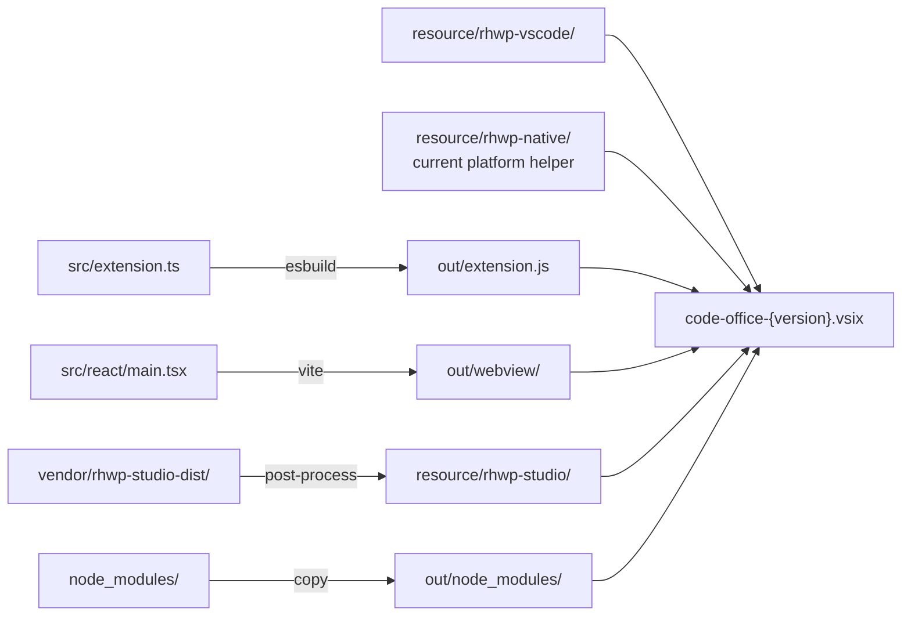

# Build Pipeline and Release

This document covers the esbuild-based build pipeline, the rhwp-studio post-processing step, the native rhwp PDF helper, VSIX packaging, verification scripts, and the release gate process.

The build pipeline matters because it has a non-trivial post-processing phase that patches the bundled rhwp-studio WASM editor for WebView compatibility. A broken patch silently produces a non-functional HWP editor with no build-time error. The verification scripts exist as the last safety gate before release.

---

## Build Architecture



## `build.ts` (229 lines)

### Phase 1: Extension Host Bundle

esbuild configuration for the Node.js extension entry point:

| Setting | Value |
|---|---|
| Entry | `src/extension.ts` |
| Output | `out/extension.js` |
| Format | CommonJS (VS Code requires CJS) |
| Platform | Node |
| External | `vscode` + specified packages |
| Production | Minified, no sourcemap |
| Development | Watch mode with rebuild |

### Phase 2: Dependency Bundling

Creates `out/node_modules/` with pre-bundled copies of:

| Package | Purpose |
|---|---|
| `vscode-html-to-docx` | Markdown → DOCX export |
| `highlight.js` | Code syntax highlighting |
| `pdf-lib` | PDF manipulation |
| `cheerio` | HTML parsing for export |
| `katex` | Math rendering |
| `mustache` | Template engine |
| `puppeteer-core` | Chromium automation for PDF export |

These are copied rather than bundled by esbuild because they have complex dependency trees or native bindings.

### Phase 3: rhwp-studio Post-Processing

This is the most critical build step. The bundled `rhwp-studio` (from `vendor/rhwp-studio-dist/`) is a standalone PWA that needs patching to work inside a VS Code WebView iframe.

#### Step A: Asset Path Rewriting

Rewrites absolute paths in HTML and CSS to relative paths. Removes PWA manifest link and service worker registration (not applicable in WebView).

#### Step B: JS Bridge Injection

1. **Locate entry point**: Find the main JS asset containing `var xu=eu();window.addEventListener`
2. **Inject direct bridge**: Add `window.__rhwpBridge = { ready, loadFile, pageCount, getPageSvg, setDebugOverlay, exportHwp, exportHwpx, markClean }` — this exposes the WASM runtime directly to the parent iframe
3. **Rewrite path function**: Change from absolute path resolution to identity function
4. **Patch postMessage calls**: Rewrite `e.source?.postMessage()` → `window.parent.postMessage()` so responses go to the correct parent frame
5. **Add token tracking**: Inject response token matching for iframe isolation security

#### Step C: Validation

- Verify bridge injection success (search for `__rhwpBridge` in output)
- Check for required patches (loadFile race condition fix)
- Ensure token injection in responses
- Ensure SVG/debug overlay bridge paths exist for both direct local calls and remote postMessage calls

### Phase 3b: rhwp-vscode Media Vendoring

`resource/rhwp-vscode/rhwp.js` and `resource/rhwp-vscode/rhwp_bg.wasm` are a matched glue/WASM pair from rhwp-vscode `0.7.13`. They are used by the extension host paragraph dump command. Do not mix them with `resource/rhwp-studio/assets/rhwp_bg-*.wasm`; that Vite-bundled WASM matches the rhwp-studio main JS asset, not the standalone host glue.

If any patch fails, the build script throws with a descriptive error. This is the primary defense against shipping a broken HWP editor.

### Phase 3c: Native rhwp PDF Helper

`npm run build:rhwp-native-pdf` builds `native/rhwp-pdf-export` with Cargo and copies the release binary into `resource/rhwp-native/<platform>-<arch>/`.

This helper is intentionally platform-scoped:

- A macOS local package includes the macOS helper for the current architecture.
- A Linux CI package includes the Linux helper built by the Ubuntu packaging job.
- Windows/Linux users without a matching helper still get HWP PDF export through the WebView image-PDF fallback.

The extension host resolves the helper by `process.platform` and `process.arch`, runs it with `execFile`, applies a 120 second timeout, and falls back when the helper is absent or fails.

### Phase 4: React WebView Build

Vite builds `src/react/` → `out/webview/`:

| Setting | Value |
|---|---|
| Entry | `src/react/main.tsx` |
| Output | `out/webview/` |
| Dev server | `http://127.0.0.1:5739` (HMR) |

In development mode, the extension loads the Vite dev server directly with hot module replacement. In production, it reads the bundled `out/webview/index.html`.

---

## CSP (Content Security Policy)

### Production CSP

```
default-src 'none';
script-src 'wasm-unsafe-eval' ${webview.cspSource};
style-src 'unsafe-inline' ${webview.cspSource};
img-src ${webview.cspSource} data: https:;
font-src ${webview.cspSource};
frame-src ${configuredStudioUrls};
connect-src ${configuredStudioUrls};
```

`'wasm-unsafe-eval'` is required for the rhwp-studio WASM runtime. `frame-src` and `connect-src` are only populated when a remote studio URL is configured.

### Development CSP

Adds `'unsafe-eval'` for Vite HMR and allows WebSocket connections to the dev server.

---

## VSIX Packaging

```bash
npx vsce package --no-dependencies
```

The `.vscodeignore` file excludes:
- Source directories (`src/`, `styles/`, `syntaxes/`)
- Build tooling (`build.ts`, `vite.config.ts`, `tsconfig.json`)
- Development files (`.github/`, `structure/`, `devlog/`)
- Vendor sources (`vendor/`)
- Native Rust source (`native/`), while built `resource/rhwp-native/<platform>-<arch>/` helpers remain included
- Node modules (only `out/node_modules/` is included)

Output: `code-office-{version}.vsix` (~33 MB, mainly rhwp-studio WASM assets)

---

## Verification Scripts

### `scripts/verify-hwp-hardening.mjs`

Pre-release gate that validates the HWP editing stack is correctly wired:

| Check | What it verifies |
|---|---|
| Activation event | `cweijan.hwpEditor` is in `activationEvents` |
| Provider registration | HWP has dedicated `CustomEditorProvider` (not readonly) |
| Priority | HWP editor is `priority: "default"` for `.hwp`/`.hwpx` |
| Office viewer exclusion | `.hwp`/`.hwpx` are NOT in the office viewer selector |
| Bundled studio | Default config uses local bundled rhwp-studio |
| Lifecycle methods | All 5 provider methods are implemented |
| Handler bindings | All HWP event handlers are registered |
| Viewer mode | Mode messages, last-mode storage, clean Viewer no-op save, and dirty save-then-view guards |
| Viewer commands | SVG export, debug overlay, paragraph dump command wiring |
| Find shortcuts | Viewer `Cmd+F` / `Ctrl+F` opens WebView search; Editor `Cmd+F` / `Ctrl+F` opens rhwp find instead of VS Code find |
| PDF export | Native-first PDF helper path, dirty-save gate, and image fallback behavior |
| Vendored media | `resource/rhwp-vscode/rhwp.js` and `rhwp_bg.wasm` exist for host paragraph dump |

### `scripts/verify-vsix.mjs`

Post-package gate that validates VSIX structure:

| Check | What it verifies |
|---|---|
| File structure | `out/extension.js`, `out/webview/`, `resource/rhwp-studio/`, `resource/rhwp-vscode/`, and current-platform `resource/rhwp-native/` helper exist |
| Manifest | `package.json` has correct name, version, publisher |
| Build artifacts | All required dependencies are bundled |
| Documentation | README, GitHub Pages, testing guide, and NOTICE retain release-critical HWP/branding coverage |
| Size | VSIX is within expected range |

---

## Release Process

```
1. Bump version in package.json
2. npm install (if dependencies changed)
3. npm run build (extension + react + rhwp post-processing)
4. npm run build:rhwp-native-pdf (current platform helper)
5. node scripts/verify-hwp-hardening.mjs
6. npx vsce package --no-dependencies
7. node scripts/verify-vsix.mjs
8. git tag v{version}
9. GitHub Release with VSIX attachment
10. npx vsce publish (Marketplace)
11. npm run publish:openvsx (Open VSX)
```

`npm run release:local` is the canonical local gate for steps 3-7. A single VSIX contains the native helper built on the packaging platform; publish or artifact strategy must account for that if native PDF quality is required on multiple operating systems.

Marketplace and Open VSX use different public publisher identities:

| Registry | Extension ID | Package source |
|---|---|---|
| VS Marketplace | `jun6161.code-office` | Normal VSIX with `publisher: "jun6161"` |
| Open VSX | `lidge-jun.code-office` | Open VSX VSIX built by `npm run package:openvsx` with `publisher: "lidge-jun"` |

Open VSX resolves the namespace from the VSIX manifest publisher. Do not publish
the normal Marketplace VSIX to Open VSX when updating `lidge-jun.code-office`;
run `npm run publish:openvsx` so the wrapper builds
`code-office-{version}-openvsx.vsix`, maps `OVSX_TOKEN` to `OVSX_PAT` when
needed, and publishes with the pinned `ovsx` CLI.

### Tag-Based GitHub Release Automation

`.github/workflows/release.yml` is the provenance path for public tag artifacts.
It runs on `v*.*.*` tags and manual dispatch:

1. `npm install`
2. `npm run release:local`
3. `npm run package:openvsx`
4. `shasum -a 256 code-office-*.vsix > SHA256SUMS.txt`
5. `actions/attest-build-provenance` for both VSIX files and checksum output
6. `actions/upload-artifact` for CI retention
7. `gh release create` for tag-triggered GitHub Releases
8. `npm run publish` for VS Marketplace when `VSCE_PAT` is configured
9. `npm run publish:openvsx` for Open VSX when `OVSX_PAT` is configured

The GitHub Release is the artifact provenance surface: users can compare
registry versions with tagged VSIX files and checksums, and maintainers can
inspect the exact CI-built packages. Registry publish is deliberately tag-gated,
not `main`-push-gated. A normal commit push still runs CI and uploads a VSIX
artifact, but only a `v*.*.*` tag can create a GitHub Release and publish to VS
Marketplace / Open VSX.

Required repository secrets for tag-based registry CD:

| Secret | Purpose |
| --- | --- |
| `VSCE_PAT` | VS Marketplace publish token used by `vsce publish`. |
| `OVSX_PAT` | Open VSX publish token used by `ovsx publish`. |

### HWP/HWPX Compatibility Evidence

`docs/HWP-HWPX-COMPATIBILITY.md` is the public support matrix. It records which
HWP/HWPX flows are verified, limited, planned, or unsupported. Private documents
are never committed as fixtures; `test-fixtures/hwp/README.md` defines the
allowed synthetic, redacted, and local-only fixture classes.

`npm run verify:hwp-compatibility` validates the matrix structure and fixture
policy. `npm run verify:release` runs that check before the VSIX verifier so a
release cannot silently drop the compatibility contract.

---

## CI / GitHub Actions

Located in `.github/workflows/`. Current configuration covers:
- Build validation on push/PR
- TypeScript type checking
- VSIX packaging verification on Ubuntu, which produces a Linux-native PDF helper in the uploaded artifact
- GitHub Pages deployment for the landing site (`docs/`)
- Tag-triggered GitHub Release artifact generation with VSIX checksums and
  artifact provenance attestations
